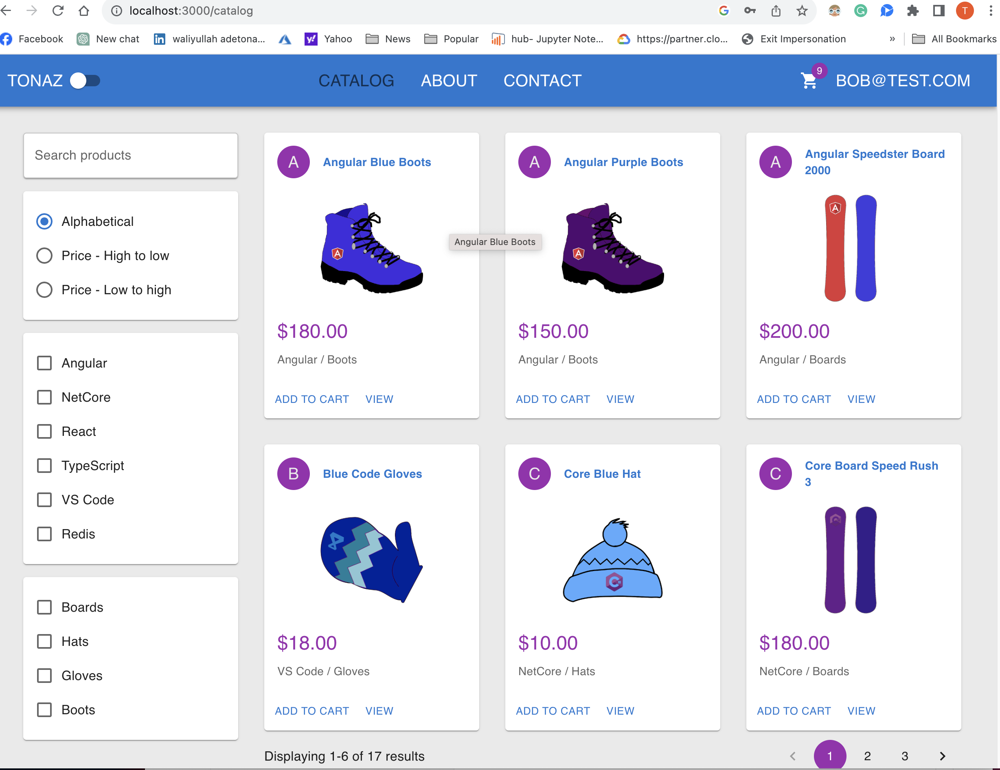
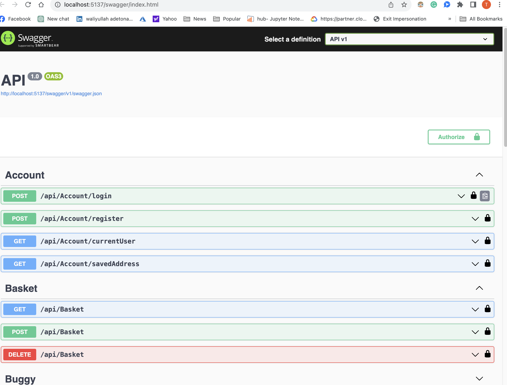

  <h2 align="center">FULL_STACK DOTNET-ECOMMERCE WITH STRIPE PAYMENT INTEGRATION</h2>
  
A FUll-Stack react-redux single page responsive application, where a user can buy a product, add to cart, update carts,search, order for products with  Stripe payment foe shipment. A user needs to sign up and login to the App

  

<!-- TABLE OF CONTENTS -->
## Table of Contents

* [About the Project](#about-the-project)
* [Installation](#installation)
* [Test](#test)
* [Live Link](#Live-Link)
* [Built With](#built-with)
* [Nice to have features](#nice-to-have-features)
* [Potential Future Updates](#potential-future-updates)
* [Contact](#authors)
* [Acknowledgements](#acknowledgments)

<!-- INSTALLATION -->

## Installation

To run the app locally, clone the repository, navigate to it's directory.

#### Follow these commands step by step:-

git clone `https://github.com/taiwo2/dotnet-react-ecommerce.git` 

 

npm install  

npm start  
 npm run dev for the Backend(Nodejs) 

Now go to [localhost:3000](http://localhost:5137/index.html) in your browser.

<!-- Test -->

## Test

To run unit test run `npm test` in root directory.

<!-- BUILD WITH -->

## Built With

- HTML/CSS
- React
- Redux/toolkit
- React Router
- Material Design Bootstrap
- Material UI
- CSS Modules
- Axios
- ES6
- NPM
- Toast
- ASP.NET/C#

<!-- Nice to have features -->

## 'Nice to have features' that are implemented
- User authentication using JWT
- Responsive to mobile and desktop screens
- React alert
- Department-wise doctors list
- Online fee payment
- Rendering Optimization

<!-- CONTACT -->
## Authors
👤 Taiwo Adetona

- Github: [@taiwo2](https://github.com/taiwo2)

- LinkedIn: [Taiwo Adetona](https://www.linkedin.com/in/taiwo-adetona/)

- Twitter: [@TaiwoAdetona4](https://twitter.com/TaiwoAdetona4/)

<!-- acknowledgments -->

## 🤝 Contributing

Contributions, issues and feature requests are welcome!

Feel free to check the [issues page](issues/).

## Show your support

Give a ⭐️ if you like this project!

## 📝 License

This project is [MIT](https://opensource.org/licenses/MIT) licensed.